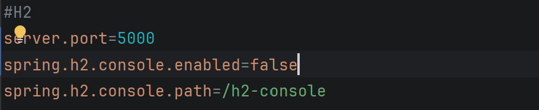
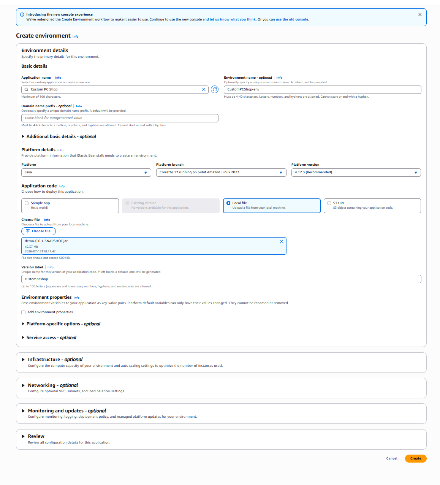
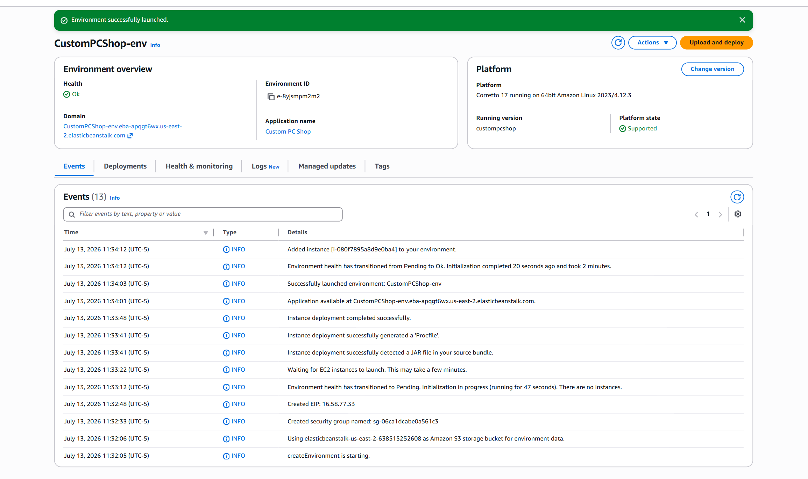
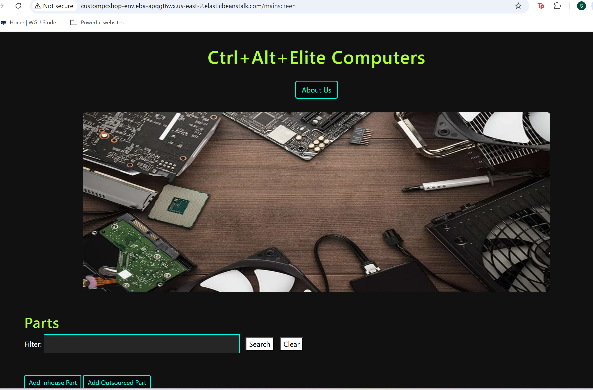
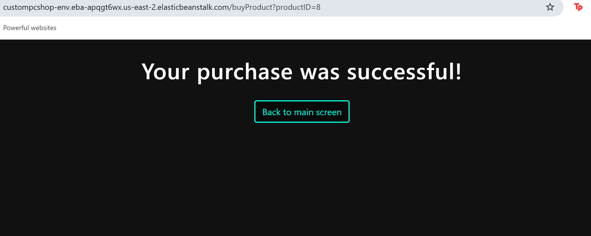

## Project Overview

This project is a full‑stack inventory management system built with the Spring Framework (Java backend) and a lightweight HTML/Thymeleaf front‑end. The application is designed for a fictional custom computer parts shop and simulates the workflow of a modern PC customization business, allowing users to manage both individual components and complete PC builds through an intuitive interface.

The system supports viewing, adding, editing, and deleting inventory items while following solid object‑oriented design principles and modular architecture. It demonstrates practical backend development, structured MVC patterns, and real‑world deployment using AWS Elastic Beanstalk.

AWS Deployment: http://custompcshop-env.eba-apqgt6wx.us-east-2.elasticbeanstalk.com/

### What It Does

- **Inventory Management (CRUD)** - Add, view, update, and delete both parts and products 
  through a web interface backed by a relational database.
- **Two Part Types** — Supports both in-house manufactured parts and outsourced parts, each 
  with their own form and validation rules.
- **Min/Max Inventory Tracking** - Every part has a defined minimum and maximum inventory 
  threshold. The system validates input in real time and blocks updates that would push 
  inventory outside that range, preventing invalid stock states.
- **Product Assembly Logic** - Products are built from associated parts, with validation to 
  ensure enough part inventory exists before a product can be created or updated.
- **Purchase Flow** - Customers can "purchase" a product directly from the main 
  inventory screen. Each purchase decrements product stock by one and displays a 
  success/failure confirmation page depending on availability.
- **Sample Data on Startup** - The app seeds itself with 5 sample parts and 5 sample products 
  on first run, so the inventory is populated and ready to explore immediately with no 
  manual setup.

### Tech Stack

- **Backend:** Java 17, Spring Boot, Spring Data JPA, Spring Validation
- **Frontend:** Thymeleaf (server-rendered HTML), CSS
- **Database:** H2 (embedded, file-based)
- **Testing:** JUnit


### Code Changes made to each section:
C.  Customize the HTML user interface for your customer’s application. The user interface should include the shop name, the product names, and the names of the parts.


Note: Do not remove any elements that were included in the screen. You may add any additional elements you would like or any images, colors, and styles, although it is not required.

*mainscreen.html:*
 - Line 13-linked demo.css
 - line 15-updated page title
 - line 20-21-updated shop name and added image element
 - line 45 and line 81-updated placeholder to "Name"

*demo.css:*
 - lines 1-68-added css styling to mainscreen.html


D.  Add an “About” page to the application to describe your chosen customer’s company to web viewers and include navigation to and from the “About” page and the main screen.

*about.html:* 
 - lines 1-27-added about.html with navigation to the main screen
*mainscreen.html:*
 - lines 21-23-added link to About page
*MainScreenController.java:*
 - lines 56-59, added "about" controller method to MainScreenController class


E.  Add a sample inventory appropriate for your chosen store to the application. You should have five parts and five products in your sample inventory and should not overwrite existing data in the database.

*BootStrapData.java:*
- line 32-35 added code for inhousePartRepository
- line 45-148-added 5 parts and 5 products to inventory
          

Note: Make sure the sample inventory is added only when both the part and product lists are empty. When adding the sample inventory appropriate for the store, the inventory is stored in a set so duplicate items cannot be added to your products. When duplicate items are added, make a “multi-pack” part.


F.  Add a “Buy Now” button to your product list. Your “Buy Now” button must meet each of the following parameters:
•  The “Buy Now” button must be next to the buttons that update and delete products.
• The button should decrement the inventory of that product by one. It should not affect the inventory of any of the associated parts.
•  Display a message that indicates the success or failure of a purchase.

*AddProductController.java:*
- line 176-201-created buyProduct method 
                     with conditionals to check if product selected is in stock. If out of stock, 
                      Failure.html displays and if in stock, Success.html displays and inventory
                           decrements for a successful purchase.

*mainscreen.html:*
- line 97-added "Buy Now" button

*Failure.html:*
- line 1-20-Failure.html created

*Success.html:*
- line 1-20-Success.html created

G.  Modify the parts to track maximum and minimum inventory by doing the following:
•  Add additional fields to the part entity for maximum and minimum inventory.

*Part.java:*
- line 33-36-added minimum and maximum variables
- line 97-112-created minimum and maximum getters and setters
             
*Mainscreen.html:*
- line 43-44-added min and max inventory headers
- line 55-56-added min and max inventory rows

•  Modify the sample inventory to include the maximum and minimum fields.

*BootStrapData.java:*
- line 51-52, 69-70, 97-98, 112-113, 127-128 -added minimum and maximum inventory fields

•  Add to the InhousePartForm and OutsourcedPartForm forms additional text inputs for the inventory so the user can set the maximum and minimum values.

*InhousePartForm.html:*
- line 28-37-added text inputs for min and max inventory

- *OutsourcedPartForm.html:*
- line 32-38-added text inputs for min and max inventory

•  Rename the file the persistent storage is saved to.

*application.properties:*
- line 6-renamed file to spring-boot-h2-db109

•  Modify the code to enforce that the inventory is between or at the minimum and maximum value.

*InventoryValidator.java:*
- line 1-43-created custom validator InventoryValidator.java
- line 29-42-IsValid method checks that inventory is between min and 
                           max value and makes sure inventory value cannot be below min inventory
                           or above max inventory. 

*ValidInventory.java:*
- line 1-24-created validator interface ValidInventory.java

*Part.java:*
- line 23-added @ValidateInventory annotation

*InhousePartForm.html:*
- line 39-44-added code to check if any fields have validation errors and display the error(s)

*OutsourcedPartForm.html:*
- line 40-45-added code to check if any fields have validation errors and display the error(s)

H.  Add validation for between or at the maximum and minimum fields. The validation must include the following:
•  Display error messages for low inventory when adding and updating parts if the inventory is less than the minimum number of parts.
- completed in part G

•  Display error messages for low inventory when adding and updating products lowers the part inventory below the minimum.

*EnufPartsValidator.java:*
- line 36-40-modified isValid method and added code to display error message if adding/updating products lowers part inventory below the minimum

•  Display error messages when adding and updating parts if the inventory is greater than the maximum.
- completed in part G

I.  Add at least two unit tests for the maximum and minimum fields to the PartTest class in the test package.

*PartTest.java*
- line 159-178 added 2 unit tests for setter methods for the min and max inventory

J.  Remove the class files for any unused validators in order to clean your code.

- deleted DeletePartValidator.java and ValidDeletePart.java


K.  Demonstrate professional communication in the content and presentation of your submission.


## How to Run Locally

### Prerequisites

- **Java 17** installed ([download here](https://adoptium.net/) if needed)
- Git (to clone the repo)
- No need to install Maven separately — this project uses the Maven Wrapper (`mvnw`)

### Steps

1. Clone the repository
```
   git clone https://github.com/SamoyaTech/D287.git
   
   cd D287 
```
3. Open the project folder in IntelliJ and let IntelliJ finish indexing and downloading Maven dependencies.
4. Open the main application class(`DemoApplication.java`) then click the Run button in the top toolbar
5. Open the app in your browser
http://localhost:8080

## Deployment Steps (AWS Elastic Beanstalk)

This project is deployed using AWS Elastic Beanstalk on the Java Corretto 17 platform.  
Below are the exact steps used to deploy the application.

### 1. Configure Production Port
Elastic Beanstalk requires Java applications to listen on port **5000**.  
In `src/main/resources/application.properties`, add:

server.port=5000




### 2. Build the Deployment JAR
Inside IntelliJ:

- Run **clean**
- Run **package**

This generates the deployment artifact:

target/demo-0.0.1-SNAPSHOT.jar

### Step 3 — Elastic Beanstalk Environment Setup


### 4. Launch the Environment
Click **Create** and wait for AWS to finish provisioning the EC2 instance and deploying the JAR.



### 5. Access the Live Application
Once deployment completes, open:

http://custompcshop-env.eba-apqgt6wx.us-east-2.elasticbeanstalk.com/





